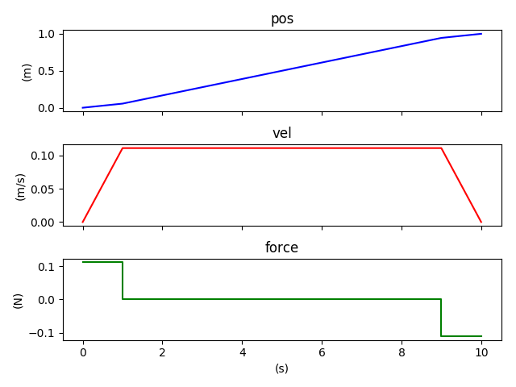
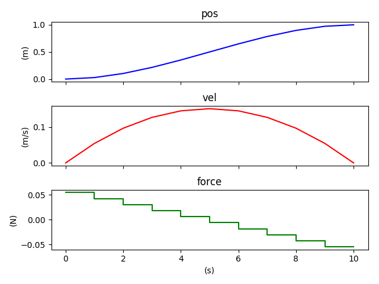
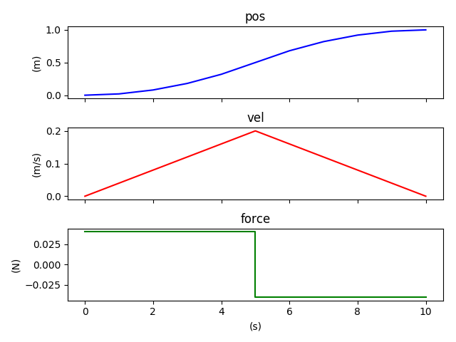

## Force-program
Here we use optimization to solve a toy physics problem. 
The solutions are my own but I stole the problem statement 
from Stephen Boyd's [textbook](http://vmls-book.stanford.edu/vmls.pdf).

With an l_1 penalty, we find that the 
optimal force program is an impulse pair. 
Observe that forces applied early on give more 
"bang for buck" since the velocity 
is enjoyed for all future times.

A momentary blast of the thruster brings
the mass to a cruising velocity until it 
is brought to an abrupt stop at the 
desired position by a symmetric impulse.

With an l_2 penalty, we find that 
the optimal force program is a staircase.

With an l_infty penalty, the optimal force 
program is a difference of step functions.

